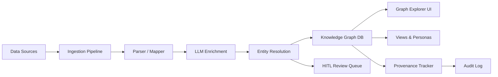
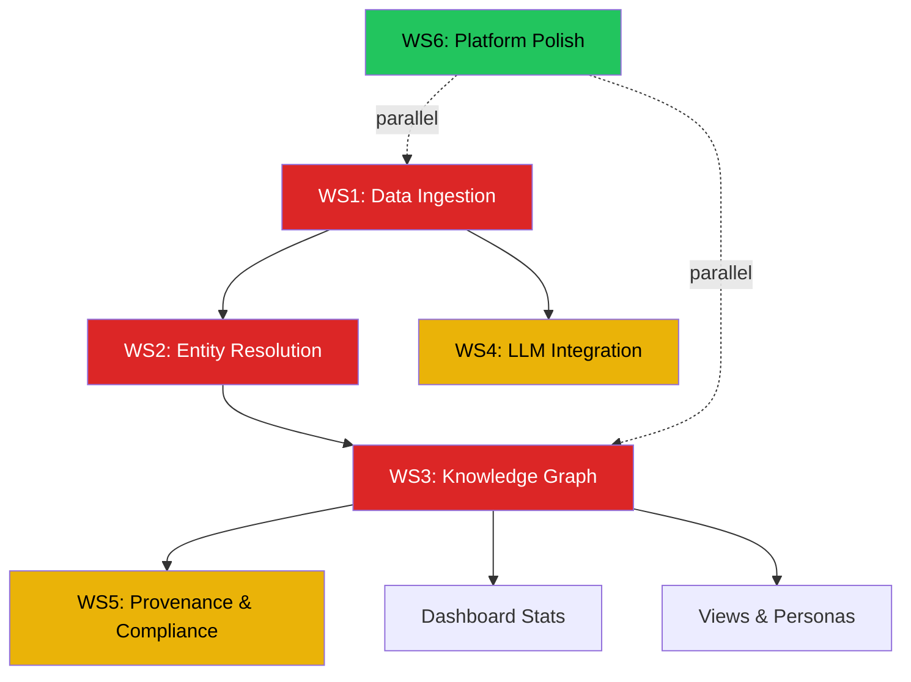

<div align="center">

# 🔐 DonnaAI — Financial Intelligence Graph

**Enterprise-grade knowledge graph platform for financial data intelligence,**
**with RBAC user management, risk-scored signups, and SOC 2-ready audit logging.**

[](https://nodejs.org)
[](https://react.dev)
[](https://docker.com)
[](https://sqlite.org)
[](LICENSE)

</div>

---

## Table of Contents

- [What Is DonnaAI?](#what-is-donnaai)
- [Quick Start](#-quick-start)
- [Requirements](#-requirements)
- [Feature Status Matrix](#-feature-status-matrix)
- [Architecture](#-architecture)
- [Module Deep Dive](#-module-deep-dive)
- [Team Task Breakdown](#-team-task-breakdown)
- [RBAC & Security Model](#-rbac--security-model)
- [API Reference](#-api-reference)
- [Running the App](#-running-the-app)
- [Environment Variables](#-environment-variables)
- [Default Admin Accounts](#-default-admin-accounts)
- [Sharing With Friends](#-sharing-with-friends)
- [Troubleshooting](#-troubleshooting)
- [Contributing](#-contributing)

---

## What Is DonnaAI?

DonnaAI is a **financial intelligence graph platform** designed for investment firms, family offices, and fintech operators. It aggregates data from multiple sources (PitchBook, SEC EDGAR, LinkedIn, Crunchbase, etc.), resolves entities using AI, and presents a unified knowledge graph with full provenance tracking.

**Core Value Proposition:**
- **Single Source of Truth (SSOT)** for canonical financial entities (orgs, funds, people, deals)
- **AI-powered entity resolution** with human-in-the-loop review
- **Full data provenance** — every field traces back to its source with confidence scores
- **Enterprise security** — RBAC, risk-scored signups, session management, immutable audit logs

---

## 🚀 Quick Start

### Option A — Automated Setup (Recommended)

**Windows (PowerShell):**
```powershell
git clone https://github.com/YOUR_USERNAME/DonnaAI_FinTech.git
cd DonnaAI_FinTech
.\setup.ps1
```

**Linux / macOS:**
```bash
git clone https://github.com/YOUR_USERNAME/DonnaAI_FinTech.git
cd DonnaAI_FinTech
chmod +x setup.sh && ./setup.sh
```

The setup script will:
- ✅ Check that Node.js 18+ and npm are installed
- ✅ Install all dependencies
- ✅ Generate a secure JWT secret in `.env`
- ✅ Create the `data/` directory for SQLite persistence
- ✅ Build the production frontend

### Option B — Docker (One Command)

```bash
git clone https://github.com/YOUR_USERNAME/DonnaAI_FinTech.git
cd DonnaAI_FinTech
docker compose up --build -d
```

App is live at `http://localhost:4001`. Share on LAN at `http://<YOUR_IP>:4001`.

### Option C — Manual Setup

```bash
git clone https://github.com/YOUR_USERNAME/DonnaAI_FinTech.git
cd DonnaAI_FinTech
npm install
cp .env.example .env          # Edit .env — set JWT_SECRET
mkdir data
npm run build                  # Build frontend
npm start                      # Start production server on :3001
```

---

## 📋 Requirements

| Prerequisite | Version | Required | Notes |
|-------------|---------|----------|-------|
| **Node.js** | 18+ | ✅ Yes | [Download](https://nodejs.org) — LTS recommended |
| **npm** | 9+ | ✅ Yes | Bundled with Node.js |
| **Git** | Any | ⚡ Recommended | For cloning |
| **Docker** | 20+ | ❌ Optional | For container deployment |

> **No external databases.** DonnaAI uses SQLite — zero infrastructure needed.

---

## 📊 Feature Status Matrix

This is the honest state of every module. **✅ Functional** means it has a working backend + frontend connected together. **🎨 UI Only** means the frontend is built with hardcoded/mock data but no backend API yet. **📋 Planned** means the feature is designed but not yet coded.

### Core Platform

| Module | Frontend | Backend | Status | Priority |
|--------|:--------:|:-------:|:------:|:--------:|
| **Authentication** (JWT + refresh tokens) | ✅ | ✅ | ✅ Functional | — |
| **Registration** (risk-scored signups) | ✅ | ✅ | ✅ Functional | — |
| **User Management** (CRUD, search, filter, suspend) | ✅ | ✅ | ✅ Functional | — |
| **RBAC** (7 roles, 30+ permissions) | ✅ | ✅ | ✅ Functional | — |
| **Approval Queue** (approve/deny with notes) | ✅ | ✅ | ✅ Functional | — |
| **Session Management** (list, revoke, IP tracking) | ✅ | ✅ | ✅ Functional | — |
| **API Key Management** (create, scoped, revoke) | ✅ | ✅ | ✅ Functional | — |
| **Security Policies** (password, lockout, session rules) | ✅ | ✅ | ✅ Functional | — |
| **Audit Logging** (immutable, append-only) | ✅ | ✅ | ✅ Functional | — |
| **Profile Panel** (account, password change, sessions) | ✅ | ✅ | ✅ Functional | — |
| **Risk Scoring Engine** | ✅ | ✅ | ✅ Functional | — |

### Intelligence Modules

| Module | Frontend | Backend | Status | Priority |
|--------|:--------:|:-------:|:------:|:--------:|
| **Dashboard** (KG overview, pipeline status, HITL queue) | 🎨 Mock | ❌ None | 🎨 UI Only | 🔴 High |
| **Knowledge Graph Explorer** (entity search, graph viz) | 🎨 Mock | ❌ None | 🎨 UI Only | 🔴 High |
| **Ingestion Pipeline** (source config, stage monitoring) | 🎨 Mock | ❌ None | 🎨 UI Only | 🔴 High |
| **Entity Resolution** (duplicate detection, merge/split) | 🎨 Mock | ❌ None | 🎨 UI Only | 🔴 High |
| **LLM Orchestrator** (prompt management, model routing) | 🎨 Mock | ❌ None | 🎨 UI Only | 🟡 Medium |
| **Provenance & Audit** (field lineage, dispute workflow) | 🎨 Mock | ❌ None | 🎨 UI Only | 🟡 Medium |
| **Views & Personas** (custom views per investor type) | 🎨 Mock | ❌ None | 🎨 UI Only | 🟢 Low |
| **Security & Compliance** (SOC 2 dashboard, alerts) | 🎨 Partial | ✅ Partial | 🟡 Partial | 🟡 Medium |

### Infrastructure

| Module | Status | Notes |
|--------|:------:|-------|
| **Docker deployment** | ✅ Done | Multi-stage build, port 4001, persistent volume |
| **Intelligent port management** | ✅ Done | Auto-detects conflicts, finds free ports |
| **Setup scripts** (Windows + Linux/Mac) | ✅ Done | Prerequisite checks, JWT generation, build |
| **MFA / TOTP** | 📋 Planned | UI designed, backend not implemented |
| **Invitations system** | 📋 Planned | DB schema exists, routes not implemented |
| **Email notifications** | 📋 Planned | No email service configured yet |
| **WebSocket real-time updates** | 📋 Planned | For live pipeline status and notifications |
| **Automated tests** | 📋 Planned | No test framework configured yet |

---

## 🏗 Architecture

```
DonnaAI_FinTech/
│
├── server/                          # ─── BACKEND (Express + SQLite) ───
│   ├── server.js                    # Entry point — intelligent port detection, middleware
│   ├── db.js                        # Schema, migrations, seed data, prepared statements
│   ├── riskEngine.js                # Signup risk scoring (0–100)
│   ├── middleware/
│   │   ├── auth.js                  # JWT verification, session tracking, token refresh
│   │   └── rbac.js                  # Role hierarchy, permission checks, escalation prevention
│   └── routes/
│       ├── authRoutes.js            # POST /login, /register, /refresh, /change-password
│       ├── userRoutes.js            # GET/PUT/DELETE /users — search, filter, suspend, edit
│       ├── sessionRoutes.js         # GET/DELETE /sessions — list, revoke, IP flagging
│       ├── apiKeyRoutes.js          # POST/GET/DELETE /api-keys — create, list, revoke
│       ├── policyRoutes.js          # GET/PUT /policies — security policy management
│       └── auditRoutes.js           # GET /audit — immutable audit log queries
│
├── src/                             # ─── FRONTEND (React 19 + Vite) ───
│   ├── main.jsx                     # React entry point
│   ├── App.jsx                      # Layout shell, sidebar, routing, profile panel
│   ├── index.css                    # Full design system (26KB — tokens, components, utilities)
│   ├── context/
│   │   └── AuthContext.jsx          # Auth state, login/register/logout, token management
│   ├── components/
│   │   ├── ProfilePanel.jsx         # Slide-out panel (account, password, sessions)
│   │   ├── Icon.jsx                 # SVG icon library (30+ icons)
│   │   ├── MiniGraph.jsx            # SVG graph visualization placeholder
│   │   ├── ConfidenceRing.jsx       # Circular confidence score display
│   │   ├── Sparkline.jsx            # Mini sparkline chart
│   │   └── Toggle.jsx               # Toggle switch component
│   └── pages/
│       ├── LoginPage.jsx            # ✅ Auth — login with error handling
│       ├── RegisterPage.jsx         # ✅ Auth — risk-scored registration
│       ├── DashboardPage.jsx        # 🎨 Mock — KG overview, pipeline status, HITL queue
│       ├── SettingsPage.jsx         # ✅ Functional — 5 tabs (Team, Approvals, Sessions, API Keys, Policies)
│       ├── GraphPage.jsx            # 🎨 Mock — knowledge graph explorer
│       ├── PipelinePage.jsx         # 🎨 Mock — ingestion pipeline management
│       ├── EntityResolutionPage.jsx # 🎨 Mock — duplicate detection, merge/split
│       ├── LLMOrchestratorPage.jsx  # 🎨 Mock — prompt management, model routing
│       ├── ProvenancePage.jsx       # 🎨 Mock — field lineage, dispute workflows
│       ├── SecurityPage.jsx         # 🟡 Partial — SOC 2 dashboard (partially connected)
│       └── ViewsPage.jsx           # 🎨 Mock — persona-based custom views
│
├── data/                            # SQLite database (auto-created, gitignored)
├── Dockerfile                       # Multi-stage build (build frontend → package server)
├── docker-compose.yml               # Port 4001, persistent volume, health check
├── setup.sh                         # Automated setup (Linux/Mac)
├── setup.ps1                        # Automated setup (Windows)
├── .env.example                     # Environment template
├── vite.config.js                   # Vite config with API proxy and flexible ports
└── package.json                     # Scripts: dev, build, start, docker:up/down/rebuild/logs
```

### Data Flow



> **Note:** Steps B through F are currently **UI mockups only**. The data flow architecture is defined but the backend processing pipeline has not been implemented yet.

---

## 🔍 Module Deep Dive

### 1. Dashboard (🎨 UI Only)
**File:** `DashboardPage.jsx` (242 lines)
**What it shows:** Knowledge Graph overview with canonical entity count (847K), ER precision (98.7%), provenance coverage (99.9%), LLM cost per record. Active ingestion pipeline stages, HITL review queue with merge/split decisions.
**What needs building:**
- Backend API to aggregate entity counts from the knowledge graph
- Real-time pipeline status endpoint
- HITL review queue CRUD (approve merge, reject, escalate)
- WebSocket for live dashboard updates

### 2. Knowledge Graph Explorer (🎨 UI Only)
**File:** `GraphPage.jsx` (82 lines)
**What it shows:** SVG graph visualization with entity types (Organization, Person, Fund, Deal), entity inspector panel with field-level confidence scores, co-investment networks, fund lineage, people moves.
**What needs building:**
- Graph database integration (Neo4j, or graph queries on SQLite)
- Entity search API with autocomplete
- Graph traversal and neighborhood queries
- D3.js or vis.js for interactive graph rendering (currently uses static SVG)
- Entity CRUD operations

### 3. Ingestion Pipeline (🎨 UI Only)
**File:** `PipelinePage.jsx` (230 lines)
**What it shows:** Source definitions (CSV, API, Web Crawler), 8-stage pipeline (Raw → Validate → Map → Parse → Embed → LLM → ER → QA → Canon), run history, scheduling config, field mapping editor.
**What needs building:**
- File upload and parsing engine (CSV, Excel, PDF)
- Data validation and cleaning rules
- Field mapping configuration storage
- Pipeline orchestration (job queue with status tracking)
- Source connector framework (API adapters for PitchBook, EDGAR, etc.)
- Scheduled run management (cron)

### 4. Entity Resolution (🎨 UI Only)
**File:** `EntityResolutionPage.jsx` (221 lines)
**What it shows:** Potential duplicate pairs with confidence scores, side-by-side comparison, merge/split actions, auto-merge rules configuration, ER statistics tracking.
**What needs building:**
- Duplicate detection algorithm (fuzzy matching, embeddings)
- Merge/split operations with provenance preservation
- Auto-merge rules engine with configurable thresholds
- Integration with the ingestion pipeline's ER stage
- HITL review workflow for low-confidence matches

### 5. LLM Orchestrator (🎨 UI Only)
**File:** `LLMOrchestratorPage.jsx` (224 lines)
**What it shows:** Prompt template management (extraction, classification, enrichment), model routing table (GPT-4o, Claude 3.5, Gemini), cost tracking, A/B testing, quality scores, guardrails configuration.
**What needs building:**
- LLM API integration layer (OpenAI, Anthropic, Google)
- Prompt template storage and versioning
- Model routing logic with fallback chains
- Cost tracking and budget enforcement
- Quality evaluation framework
- Guardrails and output validation

### 6. Provenance & Audit (🎨 UI Only)
**File:** `ProvenancePage.jsx` (93 lines)
**What it shows:** Field-level source tracking (which source contributed which value and when), confidence voting, dispute lifecycle (flag → ticket → re-ingest → adjudicate → resolve), change history.
**What needs building:**
- Field-level provenance storage (which value came from which source)
- Dispute creation and lifecycle management
- Re-ingestion triggers for disputed fields
- Provenance export for compliance reports

### 7. Views & Personas (🎨 UI Only)
**File:** `ViewsPage.jsx` (137 lines)
**What it shows:** Persona-based views (Family Office, VC, PE, AI Investor), each with default canonical fields, metrics, features, access policies, provenance visibility settings, memo/brief export.
**What needs building:**
- View configuration storage (which fields, metrics, access level)
- Persona-based data filtering
- Intelligence brief generation (PDF/Markdown export)
- View versioning and publishing workflow

### 8. Security & Compliance (🟡 Partial)
**File:** `SecurityPage.jsx` (282 lines)
**What it shows:** SOC 2 compliance dashboard, security event timeline, access review tracker, vulnerability scanner status, data classification levels.
**What's connected:** Partially reads from `useAuth()` context and some API endpoints.
**What needs building:**
- SOC 2 control mapping with evidence collection
- Automated security event aggregation
- Access review scheduling and workflow
- Integration with external vulnerability scanners
- Data flow diagram generation

---

## 👥 Team Task Breakdown

This section maps every module to a **workstream** so the team can divide and conquer efficiently. Dependencies are clearly marked.

### Workstream 1: Data Ingestion (🔴 Critical Path)
**Owner:** Backend engineer
**Depends on:** Nothing (foundational)
**Unlocks:** Entity Resolution, Knowledge Graph, Dashboard

| Task | Effort | Description |
|------|--------|-------------|
| File upload API | 2 days | Accept CSV/Excel/PDF, store in staging area |
| Parser engine | 3 days | Extract structured data from various formats |
| Field mapping config | 2 days | UI-driven source-column → canonical-field mapper |
| Validation rules | 2 days | Data quality checks, dedup detection at source |
| Pipeline orchestrator | 3 days | Job queue (BullMQ or similar), stage tracking, retry logic |
| Source connectors | 1 week | API adapters for PitchBook, SEC EDGAR, Crunchbase, LinkedIn |
| Connect Pipeline UI | 1 day | Wire `PipelinePage.jsx` to real backend APIs |

### Workstream 2: Entity Resolution (🔴 Critical Path)
**Owner:** ML/Backend engineer
**Depends on:** Workstream 1 (needs ingested data)
**Unlocks:** Knowledge Graph, Provenance

| Task | Effort | Description |
|------|--------|-------------|
| Fuzzy matching engine | 3 days | Name/org matching with Levenshtein, Jaro-Winkler, or embeddings |
| Candidate pair generation | 2 days | Blocking strategies to reduce comparisons |
| Merge/split operations | 2 days | Merge entities with provenance preservation |
| HITL review queue API | 2 days | CRUD for merge/split decisions, approval workflow |
| Auto-merge rules | 1 day | Configurable thresholds for auto-resolution |
| Connect ER UI | 1 day | Wire `EntityResolutionPage.jsx` to real APIs |

### Workstream 3: Knowledge Graph (🔴 Critical Path)
**Owner:** Full-stack engineer
**Depends on:** Workstream 2 (needs resolved entities)
**Unlocks:** Dashboard, Views, Provenance

| Task | Effort | Description |
|------|--------|-------------|
| Graph data model | 2 days | Schema for orgs, funds, people, deals + relationships |
| Graph query API | 3 days | Search, traverse, neighborhood, path queries |
| Graph visualization | 1 week | D3.js or vis.js interactive renderer, replace MiniGraph.jsx |
| Entity inspector API | 2 days | Full entity detail with field confidence scores |
| Connect Graph UI | 1 day | Wire `GraphPage.jsx` to real APIs |
| Connect Dashboard | 2 days | Wire `DashboardPage.jsx` stats to real aggregations |

### Workstream 4: LLM Integration (🟡 Medium Priority)
**Owner:** ML engineer
**Depends on:** Workstream 1 (called during ingestion)

| Task | Effort | Description |
|------|--------|-------------|
| LLM API layer | 2 days | Unified interface for OpenAI/Anthropic/Google |
| Prompt template storage | 1 day | CRUD for versioned prompt templates |
| Model router | 2 days | Route tasks to best model based on cost/quality tradeoff |
| Cost tracking | 1 day | Token counting, budget alerts |
| Quality evaluation | 2 days | Output scoring, A/B testing framework |
| Connect Orchestrator UI | 1 day | Wire `LLMOrchestratorPage.jsx` to real APIs |

### Workstream 5: Provenance & Compliance (🟡 Medium Priority)
**Owner:** Backend engineer
**Depends on:** Workstream 3 (needs graph entities)

| Task | Effort | Description |
|------|--------|-------------|
| Field-level provenance | 3 days | Track source, method, confidence for every field value |
| Dispute workflow | 2 days | Create/assign/resolve disputes with audit trail |
| SOC 2 control mapping | 2 days | Map existing features to SOC 2 control requirements |
| Compliance report generator | 2 days | Export audit data to PDF for SOC 2 readiness reviews |
| Connect Provenance UI | 1 day | Wire `ProvenancePage.jsx` to real APIs |
| Connect Security UI | 1 day | Wire `SecurityPage.jsx` to real APIs |

### Workstream 6: Platform Polish (🟢 Ongoing)
**Owner:** Frontend engineer
**Depends on:** Nothing (can be parallel)

| Task | Effort | Description |
|------|--------|-------------|
| MFA / TOTP | 2 days | Add authenticator app support (backend + UI) |
| Invitation system | 1 day | Send invite links with pre-assigned roles |
| Email notifications | 2 days | Signup approved/denied, password reset, security alerts |
| WebSocket real-time | 2 days | Live updates for pipeline status, notifications |
| Automated test suite | 3 days | Jest/Vitest for backend, Playwright for frontend |
| Mobile responsiveness | 2 days | Adapt sidebar + tables for smaller screens |
| Dark/Light theme toggle | 1 day | Currently dark only — add light mode option |

### Dependency Graph



---

## 🔒 RBAC & Security Model

### Role Hierarchy

| Role | Level | Description |
|------|:-----:|-------------|
| **Super Admin** | 1 | Full platform control, can manage all users and policies |
| **Admin** | 2 | Can manage users and approve signups, cannot modify policies |
| **Operator** | 3 | Can manage pipelines and LLM configs, read-only users |
| **Analyst** | 4 | Can view graph and data, API key access |
| **Data Steward** | 5 | Can curate graph data, approve HITL reviews |
| **Auditor** | 6 | Read-only access to audit logs and compliance data |
| **Viewer** | 7 | Read-only graph access |

### Permission Matrix

| Permission | Super Admin | Admin | Operator | Analyst | Data Steward | Auditor | Viewer |
|-----------|:---:|:---:|:---:|:---:|:---:|:---:|:---:|
| users.create | ✅ | ✅ | ❌ | ❌ | ❌ | ❌ | ❌ |
| users.approve | ✅ | ✅ | ❌ | ❌ | ❌ | ❌ | ❌ |
| users.suspend | ✅ | ✅ | ❌ | ❌ | ❌ | ❌ | ❌ |
| users.delete | ✅ | ❌ | ❌ | ❌ | ❌ | ❌ | ❌ |
| users.change_role | ✅ | ✅ | ❌ | ❌ | ❌ | ❌ | ❌ |
| graph.read | ✅ | ✅ | ✅ | ✅ | ✅ | 🔍 | ✅ |
| graph.curate | ✅ | ✅ | ❌ | ❌ | ✅ | ❌ | ❌ |
| pipeline.manage | ✅ | ✅ | ✅ | ❌ | ❌ | ❌ | ❌ |
| llm.manage | ✅ | ✅ | ✅ | ❌ | ❌ | ❌ | ❌ |
| audit.read | ✅ | ✅ | Own | Own | Own | ✅ | ❌ |
| audit.export | ✅ | ❌ | ❌ | ❌ | ❌ | ✅ | ❌ |
| policies.manage | ✅ | ❌ | ❌ | ❌ | ❌ | ❌ | ❌ |
| api_keys.manage | ✅ | ✅ | ✅ | ✅ | ❌ | ❌ | ❌ |

### Risk Scoring (Registration)

Every signup gets a 0–100 risk score:

| Factor | Score Impact | Trigger |
|--------|:-----------:|---------|
| Disposable email domain | +25 | Gmail, Yahoo, Outlook, etc. |
| Missing department | +15 | No department provided |
| Missing title | +10 | No job title provided |
| Vague reason for access | +20 | Generic text like "testing" or "just curious" |
| No referral code | +10 | Unreferred signup |
| Suspicious keywords | +20 | "test", "temp", "asdf" in any field |

---

## 📡 API Reference

Base URL: `http://localhost:3001/api`

### Authentication
| Method | Endpoint | Auth | Description |
|--------|----------|------|-------------|
| `POST` | `/auth/login` | ❌ | Login with email + password |
| `POST` | `/auth/register` | ❌ | Request access (risk-scored) |
| `POST` | `/auth/refresh` | 🔑 Refresh token | Get new access token |
| `POST` | `/auth/change-password` | 🔑 JWT | Change own password |

### Users
| Method | Endpoint | Auth | Permission | Description |
|--------|----------|------|------------|-------------|
| `GET` | `/users` | 🔑 JWT | `users.list` | List all users (search, filter) |
| `GET` | `/users/:id` | 🔑 JWT | `users.read` | Get user details |
| `PUT` | `/users/:id/role` | 🔑 JWT | `users.change_role` | Update user role |
| `PUT` | `/users/:id/approve` | 🔑 JWT | `users.approve` | Approve pending user |
| `PUT` | `/users/:id/deny` | 🔑 JWT | `users.approve` | Deny with reason |
| `PUT` | `/users/:id/suspend` | 🔑 JWT | `users.suspend` | Suspend user |
| `PUT` | `/users/:id/restore` | 🔑 JWT | `users.restore` | Restore suspended user |
| `PUT` | `/users/:id/force-reset` | 🔑 JWT | `users.force_reset` | Force password reset |
| `PUT` | `/users/:id/edit` | 🔑 JWT | `users.update` | Edit user details |
| `DELETE` | `/users/:id` | 🔑 JWT | `users.delete` | Delete user (Super Admin only) |

### Sessions
| Method | Endpoint | Auth | Description |
|--------|----------|------|-------------|
| `GET` | `/sessions` | 🔑 JWT | List all active sessions |
| `DELETE` | `/sessions/:id` | 🔑 JWT | Revoke a session |
| `DELETE` | `/sessions/user/:id/all` | 🔑 JWT | Revoke all sessions for a user |

### API Keys
| Method | Endpoint | Auth | Description |
|--------|----------|------|-------------|
| `POST` | `/api-keys` | 🔑 JWT | Create API key (shown once) |
| `GET` | `/api-keys` | 🔑 JWT | List own API keys |
| `DELETE` | `/api-keys/:id` | 🔑 JWT | Revoke an API key |

### Policies
| Method | Endpoint | Auth | Permission | Description |
|--------|----------|------|------------|-------------|
| `GET` | `/policies` | 🔑 JWT | Any | Get all security policies |
| `PUT` | `/policies` | 🔑 JWT | `policies.manage` | Update policies (Super Admin) |

### Health
| Method | Endpoint | Auth | Description |
|--------|----------|------|-------------|
| `GET` | `/health` | ❌ | Server health + feature flags |

---

## 🏃 Running the App

| Command | Use Case | Frontend | API |
|---------|----------|----------|-----|
| `npm run dev` | Development (hot reload) | `http://localhost:5173` | `http://localhost:3001` |
| `npm start` | Production | `http://localhost:3001` | `http://localhost:3001` |
| `docker compose up -d` | Docker / LAN sharing | `http://localhost:4001` | `http://localhost:4001` |

> **No port conflicts!** Docker uses port 4001, dev uses 3001. Both can run simultaneously. Vite and Express both auto-find free ports if their default is taken.

### NPM Scripts

```bash
npm run dev              # Start Vite + Express concurrently
npm run dev:frontend     # Start Vite only
npm run dev:backend      # Start Express only
npm run build            # Build production frontend
npm start                # Start production server
npm run docker:up        # docker compose up -d
npm run docker:down      # docker compose down
npm run docker:rebuild   # docker compose up --build -d
npm run docker:logs      # docker compose logs -f donna
```

---

## ⚙️ Environment Variables

| Variable | Default | Description |
|----------|---------|-------------|
| `PORT` | `3001` | Express server port |
| `NODE_ENV` | `development` | `production` serves static frontend from `dist/` |
| `JWT_SECRET` | (generated by setup script) | Secret for signing JWT tokens — **must be unique per deployment** |
| `CORS_ORIGIN` | `http://localhost:5173` | Allowed CORS origin, use `*` for Docker/LAN |
| `DATA_DIR` | `./data` | SQLite database directory |

---

## 👤 Default Admin Account

| User | Email | Role | Password |
|------|-------|------|----------|
| **DonnaAI** | `donna@donnaai.com` | Super Admin | `DonnAI2026!` |

> ⚠️ **Change this password immediately after first login** via Profile Panel → Password tab.

---

## 🌍 Sharing With Friends

1. Deploy with Docker: `docker compose up --build -d`
2. Find your IP: `ipconfig` (Windows) or `ifconfig` (Mac/Linux)
3. Share: `http://<YOUR_IP>:4001`
4. Friends register → you see their requests in **Settings → Approvals** with risk scores

---

## 🐛 Troubleshooting

| Issue | Solution |
|-------|----------|
| `EADDRINUSE` | Both Vite and Express auto-find free ports in dev mode. In production, check for conflicting processes. |
| Docker won't start | Docker uses port 4001, dev uses 3001 — they should never conflict. Check if something else is using 4001. |
| Login fails after setup | Delete `data/donna.db` and restart — the DB will be re-created with fresh seed data. |
| `MODULE_NOT_FOUND` | Run `npm install` to install dependencies. |
| Rate limited (429) | Wait 15 minutes, or restart the server to reset rate limiters. |
| Stale frontend | Run `npm run build` to rebuild, or clear browser cache. |

---

## 🤝 Contributing

### For New Team Members

1. **Read this README completely** — especially the [Feature Status Matrix](#-feature-status-matrix) and [Team Task Breakdown](#-team-task-breakdown)
2. **Pick a workstream** — check the [Dependency Graph](#dependency-graph) to see what can be worked on in parallel
3. **Run the setup script** — `.\setup.ps1` (Windows) or `./setup.sh` (Linux/Mac)
4. **Explore the mock UIs** — Every page has a working frontend mockup with the expected data shapes. Use these as your API contract.
5. **Follow the patterns** — The auth/user management backend is fully functional with complete patterns for routes, middleware, validation, and error handling. Follow the same conventions.

### Code Conventions

| Pattern | Location | Example |
|---------|----------|---------|
| Route definitions | `server/routes/*.js` | See `userRoutes.js` for CRUD patterns |
| Auth middleware | `server/middleware/auth.js` | `authenticate` for protected routes |
| RBAC checks | `server/middleware/rbac.js` | `requirePermission('users.list')` |
| Audit logging | `db.js` → `queries.insertAudit` | Every mutation must log to audit |
| Frontend API calls | `src/pages/SettingsPage.jsx` | See `fetch('/api/...')` patterns |
| Auth context | `src/context/AuthContext.jsx` | `useAuth()` hook for user state |

### Branch Strategy

```
main          ← production-ready releases
├── dev       ← integration branch
│   ├── feat/ingestion-pipeline
│   ├── feat/entity-resolution
│   ├── feat/knowledge-graph
│   └── feat/llm-orchestrator
```

---

## 📄 License

MIT — see [LICENSE](LICENSE) for details.
